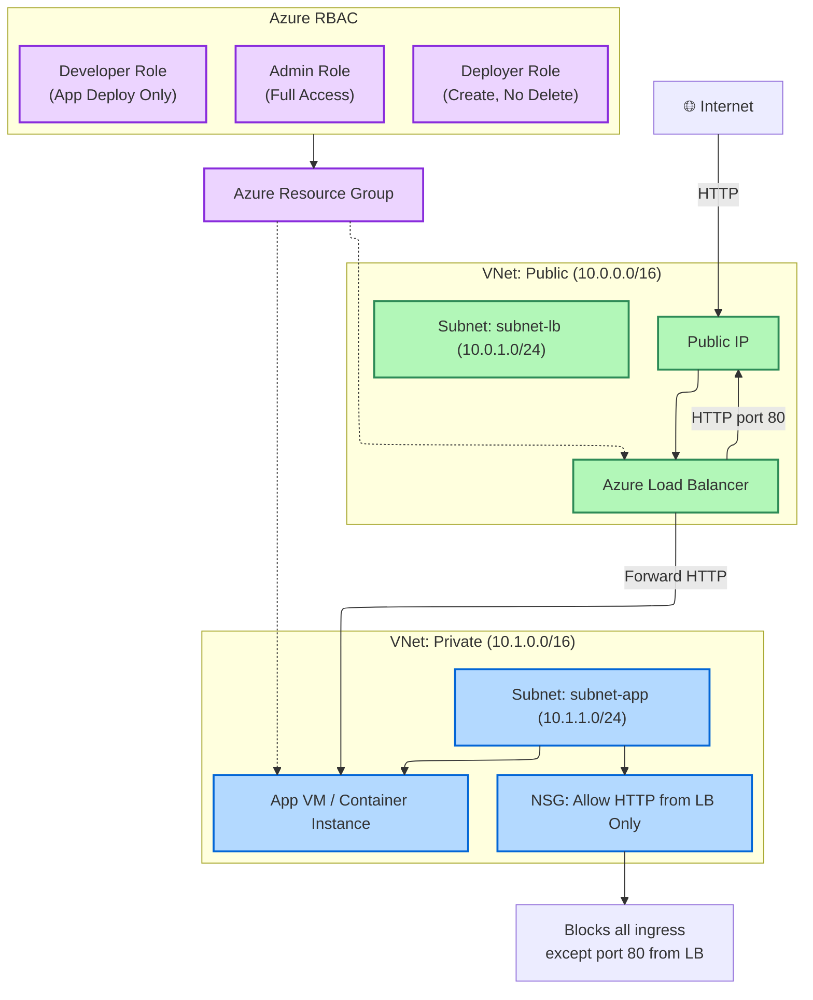
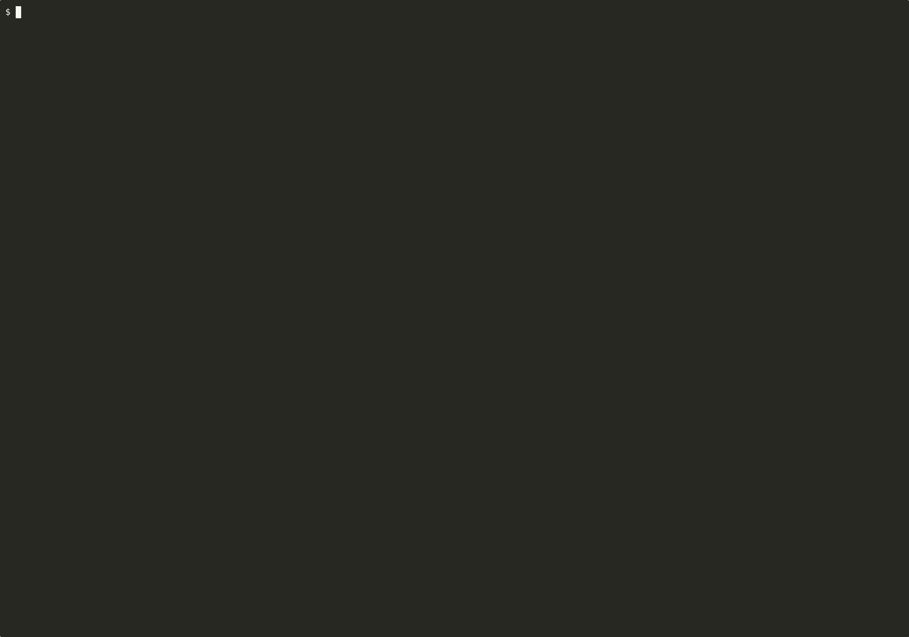

# Installation Instruction

## Azure Secure VPC + Load Balancer + RBAC Deployment Guide

This guide walks you through deploying a secure Azure infrastructure with:
- Public & Private VNets
- Load Balancer to expose only port 80
- Network Security Group rules
- Custom RBAC Roles (Admin, Deployer, Developer)




### Prerequisites

- Azure CLI (`az`)
- Terraform ≥ v1.3+
- Logged in to Azure:  
  
```bash
  az login
````

### Directory Structure

```bash
.
├── main.tf
├── modules/
│   ├── networking/
│   ├── nsg/
│   ├── load_balancer/
│   └── roles/

```

### 🔧 Step-by-Step Installation

The makefile has all the terraform command to create the necessary infrastructure. 


#### 1. Initialize Terraform

```bash

make terraform.init

```
The command that is executed is `terraform init`



#### 2. Plan the Deployment


```bash

make terraform.plan 

```

The command that is executed is `terraform plan`


#### 3. Apply the Deployment

```bash

make terraform.apply 

```

The command that is executed is `terraform apply -auto-approve`


#### 4. View Outputs

```bash

make terraform.output 

```

The command that is executed is `terraform output`


Expected outputs:

* `public_subnet_id`
* `private_subnet_id`
* `resource_group`


### Role Descriptions [ For this excercise not implemented - Need to create separate user associated to this role on Entra]

| Role      | Actions Allowed                                     |
| --------- | --------------------------------------------------- |
| Admin     | Full access (use built-in `Owner` or `Contributor`) |
| Deployer  | Can create/update but **not delete** infrastructure |
| Developer | Can deploy code to existing services only           |


### Access

* Load Balancer will expose only **port 80**
* Private subnet blocks all ingress except via Load Balancer IP

